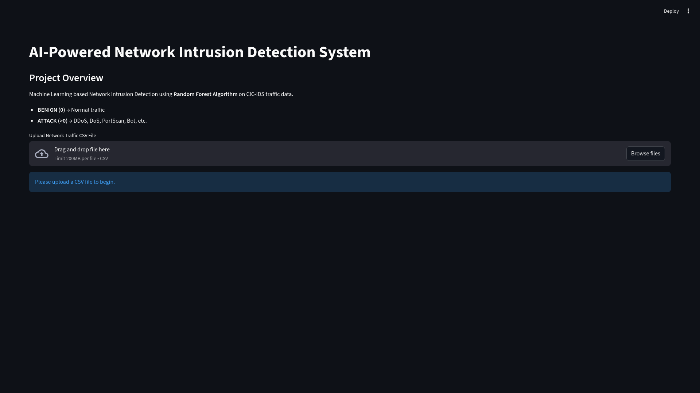
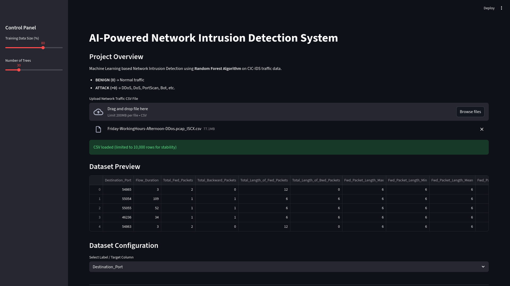
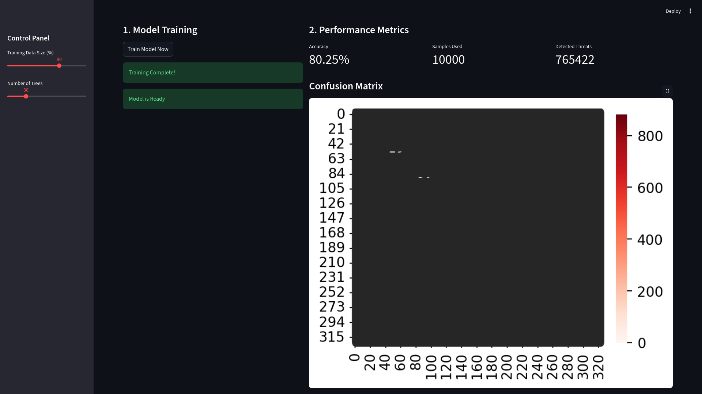
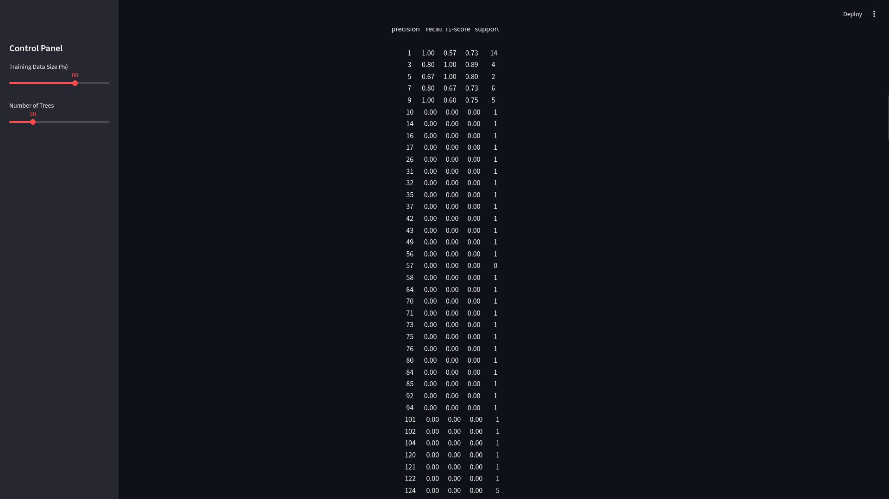
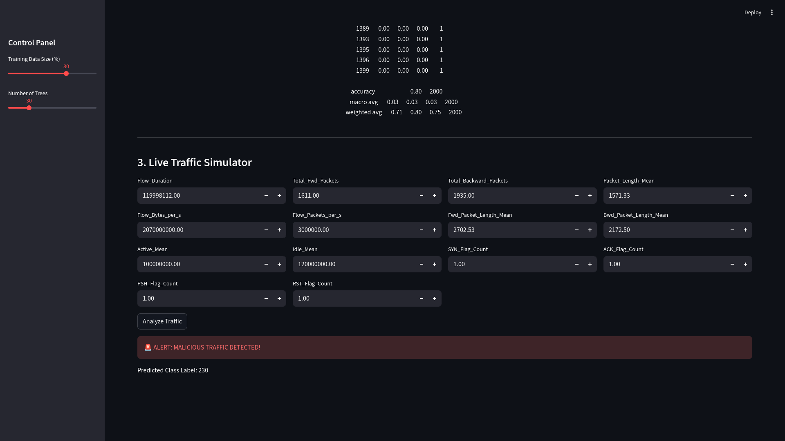

# 🛡️ AI-Powered Network Intrusion Detection System

A real-time **Machine Learning-based Network Intrusion Detection System (NIDS)** built with Python and Streamlit. Detects malicious network traffic using ensemble ML classifiers on CIC-IDS-style flow data.


---

## 📋 Table of Contents

- [Features](#-features)
- [Screenshots](#-screenshots)
- [Architecture](#-architecture)
- [Installation](#-installation)
- [Usage](#-usage)
- [Dataset](#-dataset)
- [Tech Stack](#-tech-stack)
- [Project Structure](#-project-structure)
- [Future Improvements](#-future-improvements)
- [License](#-license)

---

## ✨ Features

| Feature | Description |
|---------|-------------|
| **Multi-Model Support** | Random Forest, XGBoost, Decision Tree — compare algorithms side-by-side |
| **Interactive Dashboard** | 5-tab Streamlit UI with live controls and real-time charts |
| **Data Quality Audit** | Auto-reports missing values, duplicates, class imbalance |
| **Smart Feature Selection** | Auto-selects CIC-IDS features or lets users pick custom features |
| **Performance Metrics** | Accuracy, F1, Precision, Recall, Confusion Matrix, ROC & PR curves |
| **Feature Importance** | Visual ranking of the most influential network features |
| **Live Traffic Simulator** | Analyze individual packets with confidence scores & attack-type labels |
| **Model Export** | Download trained models (`.joblib`) for deployment |
| **Prediction Logging** | Timestamped audit trail of all predictions, exportable as CSV |
| **StandardScaler Normalization** | Feature normalization for better model convergence |

---

## 📸 Screenshots

### Landing Page


### CSV Upload & Data Explorer



### Model Training


### Performance Metrics


### Intrusion Detection Alert


---

## 🏗️ Architecture

```
┌─────────────────────────────────────────────┐
│              Streamlit Frontend              │
│  ┌────────┬────────┬────────┬────────┬────┐ │
│  │  Data  │ Train  │Metrics │Simulate│Logs│ │
│  │Explorer│        │        │        │    │ │
│  └────┬───┴────┬───┴────┬───┴────┬───┴──┬─┘ │
│       │        │        │        │      │   │
│  ┌────▼────────▼────────▼────────▼──────▼─┐ │
│  │         ML Pipeline (sklearn)          │ │
│  │  Preprocessing → Training → Inference  │ │
│  │  LabelEncoder · StandardScaler · RFC   │ │
│  └────────────────────────────────────────┘ │
│                                             │
│  ┌────────────────────────────────────────┐ │
│  │       Visualization (matplotlib/sns)   │ │
│  │  Confusion Matrix · ROC · PR · FI Bar  │ │
│  └────────────────────────────────────────┘ │
└─────────────────────────────────────────────┘
```

---

## 🚀 Installation

### Prerequisites
- Python 3.9 or higher
- pip package manager

### Setup

```bash
# Clone the repository
git clone https://github.com/cazy8/AI-Based-Network-Intrusion-Detection-System.git
cd AI-Based-Network-Intrusion-Detection-System

# Create a virtual environment (recommended)
python -m venv venv
source venv/bin/activate        # Linux/Mac
# venv\Scripts\activate         # Windows

# Install dependencies
pip install -r requirements.txt
```

---

## 💡 Usage

```bash
# Run the Streamlit dashboard
streamlit run nids_main_csv.py
```

Then open your browser to `http://localhost:8501` and:

1. **Upload** a CIC-IDS CSV file via the sidebar
2. **Explore** your data in the Data Explorer tab
3. **Configure** model parameters (algorithm, depth, estimators)
4. **Train** the model and review performance metrics
5. **Simulate** live traffic analysis with confidence scoring
6. **Export** the trained model for production deployment

---

## 📂 Dataset

This project works with **CIC-IDS2017** and **CIC-IDS2018** datasets from the Canadian Institute for Cybersecurity:

| Dataset | Link | Size |
|---------|------|------|
| CIC-IDS2017 | [Download](https://www.unb.ca/cic/datasets/ids-2017.html) | ~6 GB |
| CIC-IDS2018 | [Download](https://www.unb.ca/cic/datasets/ids-2018.html) | ~16 GB |

### Supported Attack Types
`BENIGN` · `DDoS` · `DoS Hulk` · `DoS GoldenEye` · `DoS Slowloris` · `DoS SlowHTTPTest` · `PortScan` · `Bot` · `FTP-Patator` · `SSH-Patator` · `Web Attack – Brute Force` · `Web Attack – XSS` · `Web Attack – SQL Injection` · `Infiltration` · `Heartbleed`

---

## 🛠️ Tech Stack

| Technology | Purpose |
|------------|---------|
| **Python 3.9+** | Core language |
| **Streamlit** | Interactive web dashboard |
| **scikit-learn** | ML models, metrics, preprocessing |
| **XGBoost** | Gradient boosting classifier |
| **Pandas / NumPy** | Data processing & manipulation |
| **Matplotlib / Seaborn** | Data visualization |
| **Joblib** | Model serialization & export |

---

## 📁 Project Structure

```
AI-Based-Network-Intrusion-Detection-System/
├── nids_main_csv.py          # Main Streamlit application
├── requirements.txt          # Python dependencies
├── .gitignore               # Git ignore rules
├── LICENSE                  # MIT License
├── README.md                # This file
└── screenshots/             # App screenshots
    ├── start.png
    ├── csv.png
    ├── dataset_preview.png
    ├── model_training.png
    ├── performance_matrix.png
    └── intrusion_detected.png
```

---

## 🔮 Future Improvements

- [ ] Deep Learning model (LSTM / Autoencoder) for anomaly detection
- [ ] Real-time packet capture integration with Scapy
- [ ] REST API endpoint for production deployment
- [ ] Docker containerization
- [ ] Database-backed prediction logging (SQLite/PostgreSQL)
- [ ] Model comparison dashboard (train multiple models simultaneously)
- [ ] SHAP explainability for individual predictions

---

## 📄 License

This project is licensed under the MIT License — see the [LICENSE](LICENSE) file for details.

---

<p align="center">
  Built with ❤️ using Python & Streamlit<br>
  <strong>⭐ Star this repo if you found it helpful!</strong>
</p>
